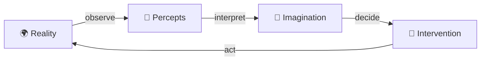
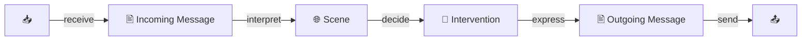

# Achieving Collective Intelligence

## What is Collective Intelligence

Purposefully place meaningful signs into the environment,

for others to pick up and add to their imagination,

and possibly change their behavior because of it.

## We already are collectively intelligent

Take a traffic light as an example:🚦

We placed this thing into the environment so human drivers see it, interpret meaning into it, and adapt their behavior accordingly.

If the light is red, stop. If the light is green go.

So this meaningful traffic light practically orchestrated coordination across multiple individuals, while each individual follows their own decision process.

## We can do better

So it seems we already are collectively intelligent. But not in a digital-native manner.

This documents outlines how digital-native collective intelligence could be structured, and attempts to formalize and implement the necessary protocol to live it out.

## Goal: Enabling more humane social coordination

Designing a new mental framework to do social coordination in, plus implementing the technical infrastructure that supports its usage.

The system shall allow everybody to express their world views and values in a non-discriminatory manner, while having an optimization process that does not inherently prioritize one human over another by default. Prioritization of humans over other humans must be an emerging property from human values and the current state of reality.

A key fact to deal with is that whatever social contract humans declare to enter, their decisions are never controlled directly. Social contracts only ever influence the behavior of humans indirectly, usually be modelling sanctions and incentives that are conditioned on whether people follow through with their actions as declared in the contract or not.

Furthermore, aligning on a shared virtual state may be part of the solution, but it is not the end goal. Really it is about shaping reality the way we like it, where pretty much all preceived human value is found in reality and not on some shared ledger. The bits in the network are just the means to get to a better reality.

Also, it's important to note that the system is not meant to be a replacement for existing social contracts, but rather a supplement to them. It serves as a common framework to define new and existing coordination mechanisms in, and offers an accounting infrastructure to operate organizations at a global scale.

## Approach

This document defines concepts one after another, gradually building up to both a technical and social architecture of collective intelligence.

After the architecture is defined, we further lay out the roadmap of getting humanity to actually use it as the default way of facilitating social coordination.

## Sensory-Motor Cycle

First, consider the sensory-motor cycle:



This diagram represents the sensory-motor cycle in a clear and concise manner using emojis to illustrate the different components. The flow of information is indicated by the arrows between each component, with the cycle starting and ending with the external environment or **🌍 Reality**. Here's a breakdown of each component:

- **🌍 Reality**: represents the external environment, which provides the sensory inputs that drive the sensory-motor cycle.
- **👀 Percepts**: represents the perception of sensory inputs, which are processed by the brain to create _percepts_.
- **🧠 Imagination**: represents the cognitive processing of percepts, which leads to the formation of mental representations and _imagination_.
- **👋 Intervention**: represents the motor output or _interventions_ generated based on the cognitive processing of percepts and imagination.
- The arrows between each component represent the flow of information, starting with the observation of sensory inputs, followed by their interpretation and cognitive processing, leading to the generation of motor output and ultimately resulting in a change in the external environment.

In case you are a human reader, you may have noticed that you operate within a sensory-motor cycle yourself. You have senses like eyes and ears to observe the world around you, a brain to interpret and process the information you receive, and a body to act upon your thoughts and feelings, ultimately shaping the world around you.

And you already have an optimization goal: Interpreting percepts in a way that helps you to decide on actions that shape the world around you in a way that leads to more preceived value in future observations.

## The Data Pipeline

Here a version of the sensory-motor diagram adapted to machines:



This version of the sensory-motor diagram adapted to machines represents a simplified model of how a computer system receives and processes messages from other computers through network protocols.

- **📥**: represents the source of received messages from other computers, communicated via a networking protocol.
- **🖹 Incoming Message**: represents the the application-specific part of the message received, as defined by the networking protocol used.
- **🌐 Scene**: represents the abstract representation of what was expressed in the messages, resulting in a virtual representation of the context or situation.
- **🦾 Intervention**: represents the decision of the computer system, based on user-defined rules that map the abstract scene to a decision about what to do.
- **🖹 Outgoing Message**: represents the message that executes the intervention that has been decided on if sent.
- **📤**: represents the destination of the newly built message which should pick it up, intertret, and have the expected causal effect.

## Modularization

Next up, we will create software modules that implement all parts of this sensory-motor cycle.

Each module comes with interface types used by semantic engineers to define domain-specific logic in.

Furthermore, each module can be hosted on a computer system, with the modules behavior being triggered by incoming messages. It may produce persistet data structures and emits messages to be routed to other module instances.

## Module: Observer Group

The module _Observer Group_ is responsible for observing the world and emitting according observations.

### Domain-Interface

_Observers_ define how new information is sourced from external systems. Implementations maintain the required network connections with external computer systems.

_Observers_ are implemented via `Sdk.IObserver<'Percept>`, where `'Percept` is a domain-specific type that represents the newly observed information.

```fsharp
[<IsReadOnly; Struct>]
type Observation<'Percept> = {
    Percepts: 'Percept array
}

type IObserver<'Percept> =
    abstract member Observations : IAsyncEnumerable<Observation<'Percept>>
```

An `Observation<'Percept>` represents an atomic appearance of sensory information. Atomic meaning that the observation appeared at a singular instant, the same point in time.

It carries one or more _Percepts_, which is a typed representation of the newly observed information.

### Behavior

On initialization, the modules takes one or more `Sdk.IObserver<'Percept>`-instances of possibly different `'Percepts`, and starts pulling `Sdk.Observation<'Percept>` from all of them via member `Observations` and processes them sequentially in the order they appear:

1. Capture current timestamp as of the _Runtime Clock_
2. Serialize observation into `DataModel.CapturedObservation`
3. Append new node the this modules _Observation Sequence_: `DataModel.ObservationSessionSequenceHead`
4. Emit message `NewObservation` linking the newest `DataModel.ObservationSessionSequenceHead`.

### Data Structure

This module produces a linked list `DataModel.ObservationSequenceHead` containing all observations made during the runtime of the module. Every time a new observation is captured, a new node is added to the list, linking to the previous node.

```fsharp
type CapturedObservation = {
    At: DateTime
    PerceptType: System.Type
    Observation: ContentId // Sdk.Observation<'Percept>
}

type ObservationSequenceHead =
    | Beginning
    | Happening of Node:ObservationSequenceNode
and ObservationSequenceNode = {
    Previous: ContentId<ObservationSequenceHead>
    Observation: ContentId<CapturedObservation>
}
```

### Messages

```fsharp
type NewObservation = {
    LatestObservations: ContentId<ObservationSequenceHead>
}
```

## Module: Observation Pool

## Module: Live Analysis

## Module: Action Execution

## Network p2p gossiping

- Observation Pool
- Action Execution Traces
- Declared Strategy Merge
- Common Merkle Clock

## Shared timestamp via Merkle Clock

## Authentication of real world data via HGTP

## Semantically computable representation of reference phrases via IEML

## Active inference for automatic world modelling

## Model-based reinforcement learning for strategy optimization