# Achieving Collective Intelligence

## What is Collective Intelligence

Purposefully place meaningful signs into the environment,

for others to pick up and add to their imagination,

and possibly change their behavior because of it.

## We already are collectively intelligent

Take a traffic light as an example:🚦

We placed this thing into the environment so human drivers see it, interpret meaning into it, and adapt their behavior accordingly.

If the light is red, stop. If the light is green go.

So this meaningful traffic light practically orchestrated coordination across multiple individuals, while each individual follows their own decision process.

## We can do better

So it seems we already are collectively intelligent. But not in a digital-native manner.

This documents outlines how digital-native collective intelligence could be structured, and attempts to formalize and implement the necessary protocol to live it out.

## Goal: Enabling more humane social coordination

Designing a new mental framework to do social coordination in, plus implementing the technical infrastructure that supports its usage.

### Non-discriminatory: allow all values across all perspective

The system shall allow everybody to express their world views and values in a non-discriminatory manner, while having an optimization process that does not inherently prioritize one human over another by default. Prioritization of humans over other humans must be an emerging property from human values and the current state of reality.

### Whatever commitment you enter, its ultimately up to you to pull through or not

A key fact to deal with is that whatever social contract humans declare to enter, their decisions are never controlled directly. Social contracts only ever influence the behavior of humans indirectly, usually be modelling sanctions and incentives that are conditioned on whether people follow through with their actions as declared in the contract or not.

### Consensus is not the end goal. End goal is to shape reality so we like it more

Furthermore, aligning on a shared virtual state may be part of the solution, but it is not the end goal. Really it is about shaping reality the way we like it, where pretty much all preceived human value is found in reality and not on some shared ledger. The bits in the network are just the means to get to a better reality.

### Adequate coordination mechanisms already exist, but not formalized

Also, it's important to note that the system is not meant to be a replacement for existing social contracts, but rather a supplement to them. It serves as a common framework to define new and existing coordination mechanisms in, and offers an accounting infrastructure to operate organizations at a global scale.

## Approach

This document defines concepts one after another, gradually building up to both a technical and social architecture of collective intelligence.

After the architecture is defined, we further lay out the roadmap of getting humanity to actually use it as the default way of facilitating social coordination.

## Sensory-Motor Cycle

First, consider the sensory-motor cycle:

```mermaid
graph LR
A["🌍 Reality"] -->|observe| B["👀 Percepts"]
B -->|interpret| C["🧠 Imagination"] 
C -->|decide| D["👋 Intervention"]
D -->|act| A
```



This diagram represents the sensory-motor cycle in a clear and concise manner using emojis to illustrate the different components. The flow of information is indicated by the arrows between each component, with the cycle starting and ending with the external environment or **🌍 Reality**. Here's a breakdown of each component:

- **🌍 Reality**: represents the external environment, which provides the sensory inputs that drive the sensory-motor cycle.
- **👀 Percepts**: represents the perception of sensory inputs, which are processed by the brain to create _percepts_.
- **🧠 Imagination**: represents the cognitive processing of percepts, which leads to the formation of mental representations and _imagination_.
- **👋 Intervention**: represents the motor output or _interventions_ generated based on the cognitive processing of percepts and imagination.
- The arrows between each component represent the flow of information, starting with the observation of sensory inputs, followed by their interpretation and cognitive processing, leading to the generation of motor output and ultimately resulting in a change in the external environment.

In case you are a human reader, you may have noticed that you operate within a sensory-motor cycle yourself. You have senses like eyes and ears to observe the world around you, a brain to interpret and process the information you receive, and a body to act upon your thoughts and feelings, ultimately shaping the world around you.

And you already have an optimization goal: Interpreting percepts in a way that helps you to decide on actions that shape the world around you in a way that leads to more preceived value in future observations.

## The Data Pipeline

Here a version of the sensory-motor diagram adapted to machines:

```mermaid
graph LR
A["📥"] -->|receive| B["🖹 Incoming Message"]
B -->|interpret| C["🌐 Scene"] 
C -->|decide| D["🦾 Intervention"]
D -->|express| E["🖹 Outgoing Message"]
E -->|send| F["📤"]
```



This version of the sensory-motor diagram adapted to machines represents a simplified model of how a computer system receives and processes messages from other computers through network protocols.

- **📥**: represents the source of received messages from other computers, communicated via a networking protocol.
- **🖹 Incoming Message**: represents the the application-specific part of the message received, as defined by the networking protocol used.
- **🌐 Scene**: represents the abstract representation of what was expressed in the messages, resulting in a virtual representation of the context or situation.
- **🦾 Intervention**: represents the decision of the computer system, based on user-defined rules that map the abstract scene to a decision about what to do.
- **🖹 Outgoing Message**: represents the message that executes the intervention that has been decided on if sent.
- **📤**: represents the destination of the newly built message which should pick it up, intertret, and have the expected causal effect.

## Modularized Implementation

Next up, we will create software modules that implement all parts of this sensory-motor cycle.

Each module comes with interface types used by semantic engineers to define domain-specific logic in.

Furthermore, each module can be hosted on a computer system, with the modules behavior being triggered by incoming messages. It may produce persistet data structures and emits messages to be routed to other module instances.

## Module: Observer Group

The module _Observer Group_ is responsible for observing the world and emitting according observations.

### Domain-Interface

_Observers_ define how new information is sourced from external systems. Implementations maintain the required network connections with external computer systems.

_Observers_ are implemented via `Sdk.IObserver<'Percept>`, where `'Percept` is a domain-specific type that represents the newly observed information.

```fsharp
[<IsReadOnly; Struct>]
type Observation<'Percept> = {
    Percepts: 'Percept array
}

type IObserver<'Percept> =
    abstract member Observations : IAsyncEnumerable<Observation<'Percept>>
```

An `Observation<'Percept>` represents an atomic appearance of sensory information. Atomic meaning that the observation appeared at a singular instant, the same point in time.

It carries one or more _Percepts_, which is a typed representation of the newly observed information.

### Behavior

On initialization, the modules takes one or more `Sdk.IObserver<'Percept>`-instances of possibly different `'Percepts`, and starts pulling `Sdk.Observation<'Percept>` from all of them via member `Observations` and processes them sequentially in the order they appear:

1. Capture current timestamp as of the _Runtime Clock_
2. Serialize observation into `DataModel.CapturedObservation`
3. Append new node the this modules _Observation Sequence_: `DataModel.ObservationSessionSequenceHead`
4. Emit message `NewObservation` linking the newest `DataModel.ObservationSessionSequenceHead`.

### Data Structure

This module produces a linked list `DataModel.ObservationSequenceHead` containing all observations made during the runtime of the module. Every time a new observation is captured, a new node is added to the list, linking to the previous node.

```fsharp
type CapturedObservation = {
    At: DateTime
    PerceptType: System.Type
    Observation: ContentId // Sdk.Observation<'Percept>
}

type ObservationSequenceHead =
    | Beginning
    | Happening of Node:ObservationSequenceNode
and ObservationSequenceNode = {
    Previous: ContentId<ObservationSequenceHead>
    Observation: ContentId<CapturedObservation>
}
```

### Messages

```fsharp
type NewObservation = {
    LatestObservations: ContentId<ObservationSequenceHead>
}
```

## Module: Observation Pool

The _Observation Pool_ is responsible for aggregating observations from multiple _Observer Groups_ which are potentially distributed in space and operated by different people.

By aggregating observations, it converges to an ordered sequence of observations which is called a _Perspective Sequence_.

### Domain-Interface

This module does not have a domain interface. No domain-specific logic is required for its operations.

### Behavior

Listens to `NewObservation` and `NewPerspective`.


### Data Structure

First, there is a linked list _Perspective Sequence_ (`DataModel.PerspectiveSequenceHead`) that specifies a temporal order among observations originating from multiple _Observation Sequences_ (`DataModel.ObservationSequenceHead`).

Second, there is an _Observation Pool_ (`DataModel.ObservationPool`) that is used to reference all available observations made within the system instance. It is a CRDT (conflict-free replicated data type) which makes it easy to gossip around and merge with other versions of the same data structure.

```fsharp
type PerspectiveSequenceHead =
    | Beginning
    | Happening of Node:PerspectiveSequenceNode
and PerspectiveSequenceNode = {
    Previous: ContentId<PerspectiveSequenceHead>
    LatestObservation: ContentId<ObservationSequenceHead>
}

type ObservationPool = {
    AggregatePerspective: ContentId<PerspectiveSequenceHead>
    DroppedPerspectives: ContentId<PerspectiveSequenceHead> Set
}
```

### Decentralization: Align on timestamp via a Merkle Clock

In the current implementation, the _Runtime Clock_ just captures the host computers clock and trust it to be accurate. _Perspective Sequences_ are then re-ordered according to those timestamps.

In a decentralized system, such a re-ordering would allow an attacker to insert an observation at an arbitrary point in time.

To prevent this, the system implements a common clock that is not controlled by any single party. This is achieved by using a Merkle Clock, as other CRDTs already proven this to work.

- Protocol Labs put out a paper ["Merkle-CRDTs
Merkle-DAGs meet CRDTs"](https://research.protocol.ai/publications/merkle-crdts-merkle-dags-meet-crdts/psaras2020.pdf)
- [Pail](https://www.youtube.com/watch?v=ukfrmBVrpo8) is a mutable key-value store that orders mutations via a Merkle Clock. Alan Shaw even created a _Merkle Clock as a Service_.
- The [Convex Protocol](http://convex.world/) uses a CRDT for convergent consensus, practically being a Merkle Clock.

## Module: Live Analysis

### Domain-Interface

On a technical level, a _Strategy_ is a pure function that maps a given situation to a _Decision_ about what to do in that moment.

That computation takes as input:

- a given _Scene_ that represents reality
- a _Reflection_ of the strategies past decisions

with _Scene_ being accessed via `Sdk.ISceneQueries` and _Reflection_ being accessed via `Sdk.IReflectionQueries`, where both interfaces represent an abstraction of the underlying data structures.

### Behavior

### Data Structure

```fsharp
type ActionInitiation = {
    ActionType: Type
    ActionCid: ContentId // CID of this.ActionType
}

type ActionSet = {
    Initiations: ActionInitiation array
}
```

### Messages

Referencing the whole _Decision Sequence_ makes `NewDecision`-messages idempotent and more tolerant to network faults, where each distinct _Decision_ has a uniqe content address and later messages carry all decisions of possibly dropped messages.

```fsharp
type NewDecision = {
    LatestDecision: ContentId<DecisionSequenceHead>
}
```

## Module: Action Execution

Some decisions are executed in the virtual only. For example, a decision to interact with a certain smart contract is executed by signing and broadcasting the desirable transaction to a blockchain network. This module is responsible for executing such actions.

### Domain-Interface

_Brokers_ handle all communication with external systems to execute actions that expectedly result in a desired effect.

Brokers are implemented via `Sdk.IBroker<'Action>`:

```fsharp
type IBroker<'Action> =
    abstract member Execute : 'Action -> Task
```

Any given `IBroker<'Action>`-instance can be instructed to execute its action by calling `Execute` and passing an instance of its `'Action`-type. The _Broker_ then sends according network IO to the related external computer networks, essentially executing the requested _Action_.

### Behavior

The module listens to `NewDecision` messages. Each such message references an _Action Set_ (`DataModel.ActionSet`), which contains one or more _Action Initiations_ (`DataModel.ActionInitiation`).

For each received _Action Initiation_, execute the following procedure:

1. Capture current timestamp as of the _Runtime Clock_ as execution start timestamp.
2. Route `'Action`-instance to matching `IBroker<'Action>` and wait for completion.
3. Build new node in this instantiations _Execution Sequence_: `DataModel.ExecutionSequenceHead`.
4. Emit message `ActionExecuted` linking the newest _Execution Sequence_.

### Data Structure

```fsharp
type ActionExecutionTrace =
    | Success of trace: byte[] option
    | Error of ``exception``: string option

type ActionExecutionResult = {
    Trace: ActionExecutionTrace
    InitiationTimestamp: DateTime
    CompletionTimestamp: DateTime
}

type ExecutionSequenceHead =
    | Start
    | Execution of Node:ExecutionSequenceNode
and ExecutionSequenceNode = {
    Previous: ContentId<ExecutionSequenceHead>
    Action: ActionInitiation
}
```

### Messages

```fsharp
type ActionExecuted = {
    LatestActionExecution: ContentId<ExecutionSequenceHead>
}
```

## Network p2p gossiping

- Observation Pool
- Action Execution Traces
- Declared Strategy Merge
- Common Merkle Clock

## Recap: Type hierarchy overview

## Coordination: Strategy Declaration (Commit)

In addition to the executable strategies executed as part of the users sensory-motor cycle, a declared strategy is shared in the public network. That declaration is used to coordinate with other subjects in the network.

```fsharp
// Todo: Define an ordered list of conditional actions
```

It explicitly represents an ordered list of conditional actions. Practically a big "if-else" statement which is executed top to bottom, with each case returning a `Sdk.Decision`.

## Coordination: Ask

An _Ask_ is an expression of desire that is shared within the network. It is defined as a boolean predicate that depends solely on a _Scene_.

```fsharp
type Fulfillment = Fulfilled | Unfulfilled
type Ask = Scene -> Fulfillment
```

An _Ask_ is considered filled if the current moments _Scene_ of the asking user satisfies the predicate.

An _Ask_ is active until its cancellation policy is triggered.

## Coordination: Proposal (Offer)

The structure of the declared strategy is chosen so to make it straight forward to communicate changes to other peoples strategy by making a _Proposal_.

This structure allows to easily construct proposals to change a given strategy. Those proposals define removals of conditional actions from the strategy, and additions of conditional actions to the strategy.

```fsharp
// Define a Proposal, adding and removing conditonal actions as a diff to an existing strategy
```

## Economics: Expectations (Simulations)

Given one or more models of the world and the current situation:

- What events could possibly happen in the future, according to the model?
- What events are likely to happen in the future, according to the model?
- How does a given _Action_ change the likelihood of future events, according to the model?

The expected probability distribution is the measure of risk on the economy.

## Role: Quant

Place bets in prediction markets about future observations.

They bet in terms of world models as defined by _Scientists_, and bet on characteristics if a future _Scene_ that reflects reality.

Markets are cash-settled, in a scalar unit of value, allowing it to be a hedge for risks.

World models already give out probability distributions. Prediction/Actualization markets add two aspects:

- Liquidity to hedge risks. Useful for coordination.
- Different odds than the world model, indicating that the model may be wrong

## Economics: Proactive Conflict Resolution (Human-Human Alignment)

If perspectives and values of different humans lead to different ideal actions

non-conflicting = (1) not causaly linked in any relevant way, as determined by all parties involved, or (2) alignment on the same ideal action, as determined by all parties involved (whereas each party might have a different _expectation_ about what future events will happen after executing those actions, but that form of disagreement is fine because there is no conflict about what to do).

## Economics: Post-Morten Conflict Resolution (Dispute)

## Decentralization: Authentication of real world data via HGTP

## Decentralization: Semantically computable & interoperable representation of reference phrases via IEML

## Privacy

## Machine learning: Model-based reinforcement learning for strategy optimization

## Role: Scientist

Come up and formalize useful models to reason about the world. That includes:

- Idetify useful reference phrases
- Define _Interpreters_ that map _Observations_ to _References_
- Define simulations for inaction- and action-scenarios.

## Machine learning: Active inference for automatic world modelling

## Role: Entrepreneur

Design and operate coordination schemes.

### Design

Formalize _Observers_, _Percepts_, _Interpretation_, _Strategy Templates_, _Brokers_, and _Actions_.

### Operate

Actually make people use the _Strategy Templates_ in a way that provides value.

Monitor quality of service, push hot fixes and updates where necessary.

## Role: Human (User)

Specify your values, your _Minimum Viable Life (MVL)_, debug your values, place asks, inspect offers, declare strategies, execute actions as commited.

# Roadmap for Humanity
